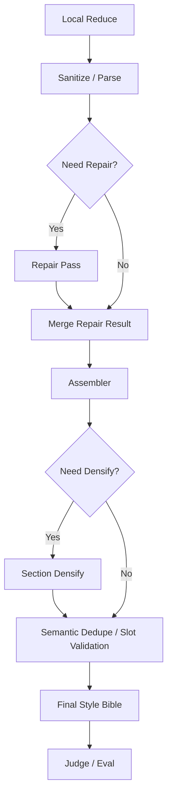

# 开源项目调研报告：对当前 Hybrid RAG / Style Bible / World Graph 路线的借鉴价值

日期：2026-04-19

适用仓库：`D:\card\novel_pipeline`

---

## 1. 执行摘要

这 5 个开源项目里，**最值得立即吸收的不是“整套框架替换”，而是其中的特定思想和局部机制**。

我的结论是：

1. **Microsoft GraphRAG：高优先级采纳**
   - 不是采纳它的整套原始文本抽图流程。
   - 而是重点采纳它的 **BYOG（Bring Your Own Graph）+ Community Summarization + Global/Local Query 分层思路**。
   - 它最适合增强你已经开工的 `World Graph Build` 离线资产层。

2. **LightRAG：中高优先级采纳**
   - 不建议整体引入 LightRAG Server 取代现有系统。
   - 但非常值得学习它的 **图检索 + 向量检索双路混合查询模式**、`QueryParam(mode)` 的运行时设计，以及 Qdrant / reranker / API 层的工程组织方式。
   - 它最适合给你未来的 **Runtime Hybrid Retriever** 提供产品化参考。

3. **DSPy：中优先级采纳，优先借理念，不急着引框架**
   - 你的 `style_bible_local_reduce.md`、`style_bible_section_densify.md`、`section_targets`、`repair_request`，已经天然接近 DSPy 的 “Signature + compile/optimize” 思维。
   - 值得学习它把 prompt 合同变成 Python 程序和指标优化问题的方式。
   - 但不建议现在重写整条 pipeline 去迁移到 DSPy。

4. **Ragas：高优先级采纳**
   - 这是当前最容易直接给你带来收益的项目之一。
   - 它非常适合增强 `style_bible_judge.py` 与未来的 retriever 评估，让你从“规则检查”升级到“语义忠实度/相关性评估”。

5. **LangGraph：中低优先级采纳**
   - 它最值得借的是 **状态机建模方法**，不是现在就把 reducer/control plane 全量改写成 LangGraph。
   - 你的 `Local Reduce -> Repair -> Densify -> Judge` 已经是一个显式的循环图，只是现在还是手写 if/else orchestration。
   - 近期更好的做法是先借它的图式抽象和 checkpoint/resume 思想，晚一点再决定是否引入框架本身。

一句话判断：

- **GraphRAG 和 Ragas 值得尽快学并局部落地。**
- **LightRAG 值得重点学检索层设计，不值得整套替换。**
- **DSPy 值得学 prompt 编译思想，不值得立刻改造全仓。**
- **LangGraph 值得学控制面抽象，但现在不宜重构上框架。**

---

## 2. 当前项目基线：它已经具备什么，缺什么

基于本地代码，当前项目已经不是“从零做 RAG”，而是一个已经分层的系统：

### 2.1 已有能力

1. `cli.py` 已经提供：
   - `build-style-bible`
   - `evaluate-style-bible`
   - `judge-style-bible`
   - `build-world-graph`

2. `style_bible_reducer.py` 已经具备：
   - repair pass
   - section densify
   - semantic dedupe
   - section target control plane
   - `worldbook_binding` 的清洗与拼装

3. `world_graph_builder.py` 已经具备：
   - node / edge / alias index / manifest 导出
   - community / node summary 级别的离线资产输出雏形

4. `style_bible_evaluator.py` 与 `style_bible_judge.py` 已经具备：
   - section completeness
   - routing hints
   - worldbook binding
   - grounding / supporting evidence / anti-pattern
   - judge case / evidence expectations

### 2.2 当前真正的缺口

当前缺口不是“有没有 embedding”或“有没有图谱”这类抽象问题，而是更具体的 4 个工程问题：

1. `Style Bible v2` 的 full profile 仍然存在 **厚度不足 / 可执行性不足**。
2. `worldbook_binding.rag_worthy` 仍然偏薄，且还没有真正升级成独立的 **World Retrieval Asset**。
3. `World Graph Build` 已经起盘，但还缺：
   - 更成熟的社区摘要层
   - 更像检索系统的 query contract
   - 图检索和向量检索的组合调度
4. `Reducer / Judge / Repair` 仍然是有效但偏“手工 orchestration”的控制平面。

所以，这次调研的核心不是“选一个框架替换现有系统”，而是：

- **哪个项目能加速你现有路线**
- **哪个项目只适合借思想，不适合直接接入**

---

## 3. 项目一：Microsoft GraphRAG

### 3.1 它最值得你看的是什么

对你最有价值的不是它的“从原始文本抽图”第一段，而是下面三层：

1. **BYOG（Bring Your Own Graph）**
   - 你已经有 `world_graph_builder.py` 和 canon 资产，不需要再用 GraphRAG 重做实体关系抽取。
   - GraphRAG 的 BYOG 思路允许你直接拿现成的 `entities / relationships / text_units` 去跑后续工作流。

2. **Community Detection + Community Reports**
   - 这是它解决“实体很多、关系很多、但 query 需要层级抽象”的关键。
   - 你现在的 `worldbook_worthy` / `worldbook_binding` 最大的问题之一，就是缺“比单条事实更高一层、但又比全文总结更结构化”的中间层。
   - GraphRAG 的社区摘要层正好可以补这个层级。

3. **Global / Local / DRIFT 三层检索语义**
   - 这为你未来的世界观检索提供了非常清楚的 query taxonomy。
   - 你的未来 world retrieval 很适合拆成：
     - `local_entity_search`
     - `global_world_search`
     - `graph_plus_community_search`

### 3.2 对当前项目的直接益处

它对你当前项目的最大收益是：

1. **把现有 World Graph 资产从“图文件导出”升级成“可供下游查询的多层摘要资产”**
2. **把 worldbook 导出从散点事实堆砌，升级成社区视角的高维世界设定**
3. **给未来的世界观检索建立清楚的输入合同**

具体说：

- 现在 `world_graph_builder.py` 更像“把 canon 变成图”
- 但 GraphRAG 会逼你进一步把图变成：
  - 原子节点/边
  - 社区
  - 社区摘要
  - 层级查询上下文

这是你现在最需要的下一步。

### 3.3 我建议你借什么，不借什么

#### 建议借

1. BYOG 工作流
2. 社区划分与社区摘要
3. `community_reports` 作为高层 world context
4. `Global Search / Local Search` 的查询语义分层
5. prompt tuning 对“图摘要”阶段的作用

#### 不建议直接借

1. 默认的原始文档切块与全套图抽取流程
2. 让 GraphRAG 重新定义你的 canon schema
3. 用它替代你现有 `canon_builder.py` / `world_graph_builder.py`

原因很简单：

- 你已经有自己的 facts/canon/graph 提取逻辑
- 你缺的是 **更强的图资产摘要层**
- 不是又来一套新的 extraction pipeline

### 3.4 具体落地建议

#### Phase G1：做 GraphRAG-compatible export

在现有 `world_graph_builder.py` 基础上新增导出：

1. `graphrag_entities.parquet`
2. `graphrag_relationships.parquet`
3. `graphrag_text_units.parquet`

映射建议：

- `entity` 节点 -> `entities.parquet`
- `relationship_change` / `fact_relation` / `states_fact` -> `relationships.parquet`
- 章节/scene 支撑证据 -> `text_units.parquet`

#### Phase G2：只跑最小 BYOG 工作流

只接入：

1. `create_communities`
2. `create_community_reports`

暂时不要一上来就追求全量 Query Engine 接入。

#### Phase G3：把社区摘要接回本项目

新增离线产物：

1. `world_graph_community_reports.jsonl`
2. `world_graph_global_digest.json`
3. `world_graph_local_context_index.json`

用途：

- `worldbook_export.py` 使用社区摘要，而不是直接拼一堆 edges
- 后续 runtime query 时，把 community report 作为高层 context

### 3.5 适配度结论

**结论：强烈推荐采纳，且应该尽快采纳。**

但采纳方式是：

- **借 GraphRAG 的后半段**
- **不要重做它的前半段**

---

## 4. 项目二：LightRAG

### 4.1 它最值得你看的是什么

LightRAG 对你最大的价值，不是“它比 GraphRAG 轻”，而是它把下面三件事做得非常工程化：

1. **把图检索和向量检索放进一个运行时 API**
2. **把 query mode 做成明确的枚举**
3. **把 storage / reranker / API / WebUI 串成一个产品化检索层**

它特别适合你参考未来的 runtime 架构，而不是参考离线抽取架构。

### 4.2 对当前项目的直接益处

LightRAG 最适合启发你的是：

1. **Runtime Hybrid Retriever 的 API 设计**
2. **Qdrant 接入层的位置**
3. **query mode 的显式控制面**

你现在非常需要的不是“再造一个全能 RAG 系统”，而是给未来运行时明确拆分：

1. `StyleRetriever`
2. `WorldGraphRetriever`
3. `HybridRouter`
4. `Reranker`

LightRAG 正好是这类问题的工程参考样本。

### 4.3 我建议你借什么，不借什么

#### 建议借

1. `QueryParam(mode=...)` 风格的检索控制面
2. `local/global/hybrid/mix` 查询模式
3. 向量库与图存储分层组织方式
4. reranker 是后接增强层、不是主流程的一部分
5. API / server / webui 的未来产品化边界

#### 不建议直接借

1. 直接把 LightRAG Server 引进来替代现有 pipeline
2. 用它重做你的 fact/style/canon/build 流程
3. 把它当作 `Style Bible v2` 的核心执行框架

原因：

1. 你的项目已经有自己的上游抽取与约束体系
2. LightRAG 的核心假设仍然偏“文档入库 -> 图/向量检索 -> 生成”
3. 你现在还有一条非常重要的 `Style Bible` 控制链，它和 LightRAG 的默认文档型 RAG 并不完全同构

### 4.4 Qdrant 应该从哪层引入

如果参考 LightRAG，我建议 Qdrant 的位置放在：

#### 应放入

1. **Style-RAG 导出层**
   - style rule embeddings
   - supporting evidence embeddings
   - bucket / axis / summary embeddings

2. **World Graph 社区摘要层**
   - community report embeddings
   - node summary embeddings
   - text unit embeddings

3. **Runtime Hybrid Retriever**
   - 作为向量检索后端

#### 不应放入

1. `style_bible_reducer.py` 的核心业务逻辑内部，作为主逻辑依赖
2. `canon_builder.py` 的事实抽取阶段
3. `world_graph_builder.py` 的图构建阶段

也就是说：

- Qdrant 应该是 **检索层基础设施**
- 不是 **抽取层或归约层业务逻辑**

### 4.5 具体落地建议

#### Phase L1：定义运行时查询模式

新增统一查询协议，例如：

```python
class RetrievalMode(str, Enum):
    STYLE = "style"
    WORLD_LOCAL = "world_local"
    WORLD_GLOBAL = "world_global"
    HYBRID = "hybrid"
    MIX = "mix"
```

#### Phase L2：做 Qdrant Export 层

建议新增：

1. `style_retrieval_export.py`
2. `world_graph_retrieval_export.py`
3. `hybrid_retrieval_manifest.json`

#### Phase L3：做检索拼装器

建议新增：

1. `style_retriever.py`
2. `world_graph_retriever.py`
3. `hybrid_retriever.py`

### 4.6 适配度结论

**结论：非常值得学习，但更适合作为“运行时检索架构参考”，而不是直接整体接入。**

---

## 5. 项目三：DSPy

### 5.1 它最值得你看的是什么

DSPy 对你最有价值的地方，是它把下面这件事做成了方法论：

> 把“Prompt 是一大段说明文字”变成  
> “输入输出签名 + Python 模块 + 指标驱动优化”

你现在的系统里，最接近 DSPy 场景的地方有三个：

1. `style_bible_local_reduce.md`
2. `style_bible_section_densify.md`
3. `style_bible_judge.py` / `style_bible_evaluator.py`

原因是：

- 这三个地方都已经有很强的输入合同
- 也都有比较明确的输出结构
- 更关键的是，你已经有 eval/judge 规则，可以作为优化目标

### 5.2 对当前项目的直接益处

DSPy 最适合帮助你解决的是：

1. **复杂 prompt 太长、太脆弱、难维护**
2. **prompt 改完后，不知道是哪些自然语言指令真正起作用**
3. **few-shot 样本和规则说明混在一起，难做系统性优化**

对你来说，它的真正价值不是“少写 prompt”，而是：

- 把 prompt 合同编译成程序化接口
- 把 prompt 调优从“拍脑袋改文案”变成“有指标驱动的实验”

### 5.3 我建议你借什么，不借什么

#### 建议借

1. Signature 思想
2. Module 思想
3. compile / optimize 思想
4. 评估指标驱动 prompt 迭代
5. few-shot 与指令分层组织的做法

#### 不建议直接借

1. 现在就把全链路 prompt 都迁移到 DSPy
2. 用 DSPy 取代你现有的 reducer / judge / eval orchestration
3. 把现有 prompt markdown 全部推翻重写

原因：

1. 你已经有一套成型的自研控制平面
2. 你的核心问题现在不是“没有框架”，而是“厚度和可执行性还没补齐”
3. 贸然引入 DSPy 会让短期目标偏离

### 5.4 具体落地建议

#### Phase D1：先做“DSPy 化抽象”，不引框架

先在你自己的代码里做下面这件事：

1. 为 Local Reduce 定义 Python Signature
2. 为 Section Densify 定义 Python Signature
3. 为 Judge 任务定义 Python Signature

例如：

```python
class LocalReduceSignature(BaseModel):
    local_reduce_bundle: dict
    surface_path_specs: list[dict]
    section_targets: dict
    repair_request: dict | None = None


class LocalReduceOutput(BaseModel):
    reasoning_entries: list[dict]
    rule_rows: list[dict]
```

这样做的意义是：

- 先把 prompt 的“接口层”和“文案层”分开
- 即使暂时不用 DSPy，收益也很大

#### Phase D2：把优化问题局部化

不要用 DSPy 优化整条 pipeline。

先只拿一个高价值子任务试点：

1. `routing_hints` 生成
2. `rag_worthy` 生成
3. scalar repair

这些都是：

- 有清晰成功标准
- 可以构造训练/验证集
- 适合做 prompt compile / optimize 的模块

#### Phase D3：做指标驱动的 prompt 实验 harness

建议新增：

1. `prompt_contract_bench.py`
2. `dspy_like_signature_tests.py`
3. `prompt_ablation_report.py`

### 5.5 适配度结论

**结论：值得学，值得局部落地，但不建议现在全量引框架。**

对你来说，DSPy 更像一套“第二阶段 prompt 工程学”，而不是眼下最先要接的依赖。

---

## 6. 项目四：Ragas

### 6.1 它最值得你看的是什么

Ragas 对你最大的价值，是它把“RAG 好不好”拆成了可计算的指标，而不是只看最终主观感觉。

对你当前项目，最相关的两个指标是：

1. **Faithfulness**
2. **Answer Relevancy / Response Relevancy**

这两个指标和你现在的问题几乎天然对齐。

### 6.2 对当前项目的直接益处

你现在的 `style_bible_judge.py` 已经做了很多规则和 evidence 相关检查，但还偏“自定义规则裁判”。

Ragas 可以补的，是更通用的语义评估层：

1. **Faithfulness**
   - 规则是否真的能从 supporting evidence / retrieved context 推出来
   - 很适合约束：
     - `rag_worthy`
     - `worldbook_worthy`
     - `routing_hints`
     - `supporting_evidence.claim`

2. **Response Relevancy**
   - 生成的 rule / routing hint 是否真的回应了目标 query / repair target / slot target
   - 很适合检查：
     - repair pass 到底有没有补中目标
     - densifier 是不是在胡乱凑条数

### 6.3 我建议你借什么，不借什么

#### 建议借

1. Faithfulness 指标
2. Relevancy 指标
3. 后续再考虑 context precision / context recall
4. 离线评估数据格式和评估 harness 思路

#### 不建议直接借

1. 直接用 Ragas 替代你的全部 judge 逻辑
2. 把 Ragas 指标立刻设成主流程 hard gate
3. 不做校准就直接把 style rule 当普通 QA answer 来测

原因：

1. 你的输出不是纯 QA answer，而是结构化规则
2. 需要先做“规则文本 -> 可评估 response”的适配
3. 更适合先做离线评估增强，再决定是否进入线上 gate

### 6.4 具体落地建议

#### Phase R1：先做离线 metric runner

建议新增：

1. `style_ragas_eval.py`
2. `retriever_ragas_eval.py`

输入映射建议：

- `user_input`
  - 下游查询问题
  - 或 repair target
  - 或 slot 描述

- `response`
  - rule text
  - routing hint text
  - worldbook export text

- `retrieved_contexts`
  - supporting evidence
  - reasoning entries
  - 检索回来的 text units / node summaries / community reports

#### Phase R2：挂到 Judge 的非阻塞报告里

先把它作为：

1. `judge_report.json`
2. `judge_report.md`
3. 回归基线对比项

而不是一开始就阻塞构建。

#### Phase R3：等校准后再进入 hard gate

当你有一批稳定样本后，再考虑对：

1. `worldbook_binding`
2. runtime retrieval
3. graph query answer

设置最低 Faithfulness / Relevancy 门槛。

### 6.5 适配度结论

**结论：非常值得尽快落地，而且落地成本相对低。**

在这 5 个项目里，Ragas 是最适合短期直接转化成收益的一个。

---

## 7. 项目五：LangGraph

### 7.1 它最值得你看的是什么

LangGraph 对你最有价值的，不是“Agent”那部分，而是：

1. `StateGraph`
2. reducer/state update 思维
3. conditional edges
4. persistence / checkpoint / resume
5. evaluator-optimizer workflow

这几乎正好对应你当前 control plane 的痛点。

### 7.2 对当前项目的直接益处

你现在的 reducer/control plane 已经隐含是一个图：

1. Local Reduce
2. Parse / sanitize
3. Repair decision
4. Repair pass
5. Assemble
6. Section densify
7. Judge / Eval
8. Resume / retry / continue

只是目前它主要由 Python if/else、目录状态、resume 参数和 artifact 文件共同维护。

LangGraph 的价值在于提醒你：

- 把这个流程显式建成一个状态图，会让维护成本下降
- checkpoint / resume / replay / fault recovery 的概念值得系统化

### 7.3 我建议你借什么，不借什么

#### 建议借

1. State schema 显式建模
2. Node / edge / route 的显式化
3. evaluator-optimizer loop 设计
4. checkpoint / resume / replay 思路
5. reducer 作为状态合并机制

#### 不建议直接借

1. 现在就把 reducer/control plane 整体重写成 LangGraph
2. 让 LangGraph 成为构建-style-bible 的第一优先级依赖
3. 为了“图式优雅”牺牲现有稳定 artifact/resume 机制

原因：

1. 你已经有可工作的 CLI、artifact、resume 路径
2. 现在最紧迫的问题仍是输出厚度与可执行性
3. 先重构 orchestration，会推迟真正影响质量的工作

### 7.4 具体落地建议

#### Phase LG1：先做“LangGraph 化设计”，不接框架

建议先新增一份控制流文档或 mermaid 图，把当前流程显式化：



#### Phase LG2：抽出统一状态对象

建议新增统一状态模型：

1. `ReduceJobState`
2. `RepairState`
3. `DensifyState`
4. `JudgeState`

#### Phase LG3：仅在下一阶段再决定是否引框架

如果后面出现下面这些信号，再考虑 LangGraph 框架化：

1. repair loop 变成多轮、多节点、跨线程持久化
2. 需要更强的 checkpoint/replay
3. 需要把 world retrieval / runtime orchestration 也纳入统一图式执行

### 7.5 适配度结论

**结论：现在适合借方法，不适合大重构。**

---

## 8. 五个项目的采纳优先级

| 项目 | 当前适配度 | 近期收益 | 接入成本 | 建议 |
| --- | --- | --- | --- | --- |
| Microsoft GraphRAG | 很高 | 很高 | 中 | 立即采纳其 BYOG + community summarization 思路 |
| Ragas | 很高 | 很高 | 低到中 | 尽快做 judge/eval 增强 |
| LightRAG | 高 | 中高 | 中 | 借运行时混合检索设计，不整体接入 |
| DSPy | 中高 | 中 | 中到高 | 先借 signature/optimizer 思想，不全量接框架 |
| LangGraph | 中 | 中 | 高 | 先借控制面建模方法，暂不重构 |

---

## 9. 最终建议：基于现有项目的落地路线

### 9.1 未来 1 周：先做“低风险高收益”的两件事

1. **接 Ragas 到 Judge/Eval**
   - 新增 Faithfulness / Relevancy 的离线报告

2. **把 GraphRAG 的 BYOG 方案接到 World Graph 离线资产层**
   - 先只做 `entities / relationships / text_units` 导出
   - 再做 community reports

### 9.2 未来 2-3 周：开始 Hybrid Retriever 工程化

1. 新增 `style_retriever.py`
2. 新增 `world_graph_retriever.py`
3. 新增 `hybrid_retriever.py`
4. 引入 Qdrant 作为检索层向量后端
5. 借 LightRAG 设计 query mode

### 9.3 未来 3-5 周：做 Prompt 工程系统化

1. 把 Local Reduce / Densify / Judge 合同抽象成 Python Signature
2. 做 prompt ablation bench
3. 只在单模块试点 DSPy 化优化

### 9.4 未来 5 周后：再决定是否做 LangGraph 化重构

判断标准：

1. repair loop 是否继续变复杂
2. 是否需要统一 runtime orchestration
3. 当前 resume / checkpoint 是否已经难维护

---

## 10. 我的最终判断

如果只允许我给一个最务实的答案，那就是：

1. **GraphRAG：立刻学，立刻借，借它的社区摘要和 BYOG。**
2. **Ragas：立刻接，最快变成可量化收益。**
3. **LightRAG：重点学 query mode 和 hybrid retrieval，不整套引。**
4. **DSPy：先学理念，把 prompt 合同程序化，晚一点再试点。**
5. **LangGraph：先学控制面建模，不要现在就重构。**

对当前项目最正确的姿势不是：

> “找一个开源框架把现有系统替换掉”

而是：

> “让这些成熟项目分别增强你已经存在的  
> Style Bible 控制平面、World Graph 资产层、Hybrid Retriever 和 Judge 体系”

这才是和你当前代码状态最匹配、风险最小、收益最大的落地方式。

---

## 11. 建议直接转成实施任务的清单

### A. GraphRAG 方向

1. 为 `world_graph_builder.py` 增加 GraphRAG BYOG 导出
2. 新增社区摘要生成脚本
3. 新增 `world_graph_community_reports.jsonl`
4. 新增世界观检索 contract

### B. LightRAG 方向

1. 设计统一 `RetrievalMode`
2. 接入 Qdrant export / ingest
3. 设计 `StyleRetriever + WorldGraphRetriever + HybridRetriever`
4. 预留 reranker 插槽

### C. DSPy 方向

1. 抽象 Local Reduce / Densify Signature
2. 建 prompt contract bench
3. 只针对 `routing_hints` / `rag_worthy` 做单点优化试验

### D. Ragas 方向

1. 新增离线 Faithfulness 评估
2. 新增离线 Relevancy 评估
3. 将结果并入 `judge_report`

### E. LangGraph 方向

1. 先补控制面 mermaid 图
2. 抽统一 state schema
3. 仅在复杂度继续上升时考虑框架化重构

---

## 12. 官方资料清单

### Microsoft GraphRAG

- 官方文档：`microsoft.github.io/graphrag`
- 核心关注：
  - Overview
  - Query Overview
  - Default Dataflow
  - Outputs
  - Bring Your Own Graph

### LightRAG

- 官方仓库：`github.com/HKUDS/LightRAG`
- 官方论文：`arXiv:2410.05779`
- 核心关注：
  - `docs/ProgramingWithCore.md`
  - `docs/LightRAG-API-Server.md`

### DSPy

- 官方站点：`dspy.ai`
- 核心关注：
  - Signature
  - Module
  - MIPROv2 / BootstrapRS / BootstrapFinetune

### Ragas

- 官方文档：`docs.ragas.io`
- 核心关注：
  - Faithfulness
  - Response Relevancy
  - Context Precision / Context Recall

### LangGraph

- 官方文档：`docs.langchain.com/oss/python/langgraph`
- 核心关注：
  - Overview
  - Graph API
  - Persistence
  - Workflows and agents
  - Evaluator-optimizer

